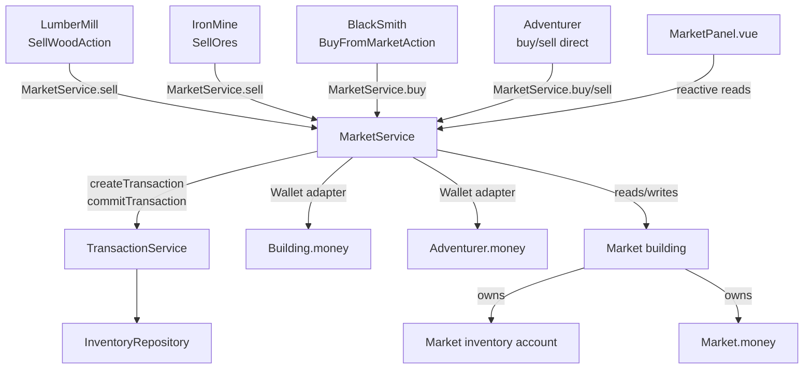

# Design Document — City Market

## Overview

The City Market is a new `BaseBuilding` subclass that acts as the city's centralised trading hub. Producers (LumberMill, IronMine, BlackSmith) deliver goods to it via the existing `TransportAction` flow; buildings and adventurers purchase from it via a new `BuyFromMarketAction` or direct API call. All goods movement continues through the existing `InventoryRepository` / `TransactionService` pipeline. A thin `Wallet` adapter decouples `MarketService` from concrete entity types. A Vue 3 SFC (`MarketPanel.vue`) surfaces stock, prices, and recent trades reactively.

## Steering Document Alignment

### Technical Standards
- TypeScript strict mode throughout; no `any`.
- Singleton pattern for services (`export default new MarketService()`), matching `InventoryRepository` and `TransactionService`.
- Vue 3 Composition API / `reactive()` for reactivity, no store library.
- No persistence layer — all state is in-memory, consistent with the rest of the game.

### Project Structure
```
src/
├── modules/market/
│   ├── common.ts            # TradeRecord, error classes, Wallet interface
│   └── market.service.ts    # MarketService singleton
├── game/city/buildings/
│   ├── Market.ts            # Market extends BaseBuilding
│   └── actions/
│       └── BuyFromMarketAction.ts
└── components/buildings/
    └── MarketPanel.vue
```
Follows the existing pattern: domain logic in `src/modules/`, game entities in `src/game/`, UI in `src/components/`.

## Code Reuse Analysis

### Existing Components to Leverage
- **`BaseBuilding`** (`src/game/city/buildings/common/Building.ts`): Market extends it — gets `inventory`, `money`, `workers`, `handleTick`, `chooseNextAction` lifecycle for free.
- **`TransactionService`** (`src/modules/inventory/transaction.service.ts:12,47`): `createTransaction` / `commitTransaction` for all goods movement. Never bypassed.
- **`InventoryAccountService`** (`src/modules/inventory/inventory.service.ts`): Market's inventory is just another account; `getCountByGoodId`, `takeGoods`, `put` all reused.
- **`ItemRegistry`** (`src/modules/items/registry.ts:9`): `ItemRegistry[id].value` is the sole price source.
- **`TransportAction`** (`src/game/city/buildings/common/Action.ts:131`): `BuyFromMarketAction` mirrors its structure (tick countdown, start/finish lifecycle); only the money direction is reversed.
- **`WaitAction`** (`src/game/city/buildings/common/Action.ts:153`): returned by `Market.chooseNextAction()`.
- **Vue `reactive()`** (`src/App.vue:56-57`): Market singleton wrapped in `reactive()` for UI reactivity.

### Integration Points
- **`City.ts`**: instantiates `Market`, includes it in `buildings` array so `handleTick` covers it automatically.
- **`TransportAction.finished()`**: replaced with `MarketService.sell(...)` call — the only change to the existing sell path.
- **`BuildingsList.vue`**: Market entry added alongside LumberMill / IronMine / BlackSmith.
- **`App.vue`**: Market panel wired into the building selection switch.

## Architecture



### Modular Design Principles
- **`MarketService`** owns trade orchestration only; it does not import `BaseBuilding` or `Adventurer`.
- **`Market` (building)** owns state (inventory + money + workers), participates in tick loop, nothing else.
- **`MarketPanel.vue`** reads from `MarketService` reactively; triggers no mutations itself (read-only in this iteration).
- **`BuyFromMarketAction`** encapsulates the buy-side travel-tick cost; `MarketService` is unaware of actions.

## Components and Interfaces

### `src/modules/market/common.ts`
- **Purpose:** Shared types for the market module.
- **Interfaces:**
  ```typescript
  export interface Wallet {
    get(): number;
    add(n: number): void; // throws if n < 0 and balance would go negative
  }

  export type TradeRecord = {
    tick: number;
    side: 'buy' | 'sell';
    counterpartyId: string;
    items: Map<ItemID, number>;
    total: number;
  };

  export class MarketInsufficientFundsError extends Error {}
  export class MarketInsufficientStockError extends Error {}
  ```
- **Dependencies:** `ItemID` from `src/modules/items/id.ts`.

---

### `src/modules/market/market.service.ts`
- **Purpose:** Singleton orchestrating all market trades.
- **Interfaces:**
  ```typescript
  class MarketService {
    // Set once by City after Market building is instantiated
    init(market: Market): void

    getStock(): Map<ItemID, number>
    getPrice(itemId: ItemID): number  // ItemRegistry[itemId].value

    sell(sellerId: InventoryID, sellerWallet: Wallet, items: Map<ItemID, number>): void
    buy(buyerId: InventoryID, buyerWallet: Wallet, items: Map<ItemID, number>): void

    readonly recentTrades: TradeRecord[]  // ring buffer, max 20
  }
  export default new MarketService()
  ```
- **Dependencies:** `TransactionService`, `InventoryAccountService` (via Market ref), `ItemRegistry`, `common.ts`.
- **Reuses:** `TransactionService.createTransaction` / `commitTransaction`.

**`sell` flow (R2):**
1. `TransactionService.createTransaction(sellerId, 'market', items, items)` — creates pending transaction.
2. Compute `total = Σ items[id] × getPrice(id)`.
3. If `Market.money < total` → throw `MarketInsufficientFundsError` (transaction not committed, goods stay with seller).
4. `TransactionService.commitTransaction(txId)` — goods move seller → market.
5. `market.money -= total; sellerWallet.add(total)`.
6. Push `TradeRecord` to ring buffer (evict oldest if at cap).

**`buy` flow (R3):**
1. Validate market stock via `InventoryRepository.validateLedger('market', items)` — throws `MarketInsufficientStockError` if false.
2. Validate `buyerWallet.get() >= total` — throws `MarketInsufficientFundsError` if false.
3. `TransactionService.createTransaction('market', buyerId, items, items)`.
4. `TransactionService.commitTransaction(txId)` — goods move market → buyer.
5. `buyerWallet.add(-total); market.money += total`.
6. Push `TradeRecord`.

---

### `src/game/city/buildings/Market.ts`
- **Purpose:** City-wide market building entity.
- **Interfaces:**
  ```typescript
  export class Market extends BaseBuilding {
    readonly id = 'market'
    money: number  // initial: MARKET_INITIAL_MONEY = 1000
    // inventory: InventoryAccountService — inherited from BaseBuilding
    // workers: [] — no autonomous workers

    chooseNextAction(): Action  // returns new WaitAction()
  }
  ```
- **Dependencies:** `BaseBuilding`, `WaitAction`, `InventoryAccountService`.
- **Reuses:** Full `BaseBuilding` lifecycle (tick, workers, inventory).

---

### `src/game/city/buildings/actions/BuyFromMarketAction.ts`
- **Purpose:** Action that lets a building purchase goods from the Market, consuming worker ticks for travel.
- **Interfaces:**
  ```typescript
  export class BuyFromMarketAction extends Action {
    constructor(
      building: BaseBuilding,
      items: Map<ItemID, number>,
      ticks: number  // travel cost, default same as TransportAction
    )
    // finished(): calls MarketService.buy(building.id, building.wallet, items)
  }
  ```
- **Dependencies:** `Action`, `MarketService`, `Wallet` adapter built from `building.money`.
- **Reuses:** `Action` lifecycle (start / tick / finished hooks).

---

### Wallet adapter (inline in callers, not a separate file)
```typescript
// Built by building/adventurer before calling MarketService
const wallet: Wallet = {
  get: () => entity.money,
  add: (n) => {
    if (entity.money + n < 0) throw new MarketInsufficientFundsError(...)
    entity.money += n
  }
}
```

---

### `src/components/buildings/MarketPanel.vue`
- **Purpose:** Read-only market dashboard: stock table, unit prices, Market balance, recent trades.
- **Interfaces:** Receives `market: Market` and `marketService: MarketService` as props (both wrapped in `reactive()` upstream in `App.vue`).
- **Dependencies:** `MarketService`, `Market`, `ItemRegistry` (for item names).
- **Reuses:** Same `reactive()` reactivity pattern as other building panels.

---

### Changes to existing files

| File | Change |
|------|--------|
| `src/modules/inventory/common.ts` | Add `'market'` as a valid `InventoryID` string constant / `BuildingID` union |
| `src/modules/inventory/inventory.repository.ts:164` | Fix `validateLedger`: replace `forEach` with `for...of` / `Array.prototype.every` so early-return on missing goods works |
| `src/game/city/City.ts` | Instantiate `Market`; add to `buildings`; call `marketService.init(market)` |
| `src/game/city/buildings/common/Action.ts` | `TransportAction.finished()`: replace `this.building.money += this.value` with `marketService.sell(this.building.id, buildingWallet, this.input)` |
| `src/game/city/buildings/LumberMill.ts` | `SellWoodAction` destination inventory already set to Market via `TransportAction`; no other change needed once `TransportAction.finished()` delegates |
| `src/game/city/buildings/IronMine.ts` | Same as LumberMill |
| `src/game/city/buildings/BlackSmith.ts` | Add `BuyFromMarketAction` branch in `chooseNextAction()`: if `IronOre < BLACKSMITH_ORE_BUY_THRESHOLD && money >= price * BLACKSMITH_ORE_BATCH` |
| `src/components/left-menu/BuildingsList.vue` | Add Market entry |
| `src/App.vue` | Wrap `market` in `reactive()`; wire `MarketPanel` in building-selection switch |
| `src/game/adventurer/Adventurer.ts` | Expose temporary buy/sell method that builds a `Wallet` adapter and calls `MarketService.buy/sell` |

## Data Models

### `TradeRecord`
```typescript
type TradeRecord = {
  tick: number;           // game tick when trade settled
  side: 'buy' | 'sell';  // from Market's perspective
  counterpartyId: string; // InventoryID of the other party
  items: Map<ItemID, number>;
  total: number;          // gold exchanged
}
```

### `Market` state
```typescript
{
  id: 'market',
  money: number,           // starts at 1000
  inventory: InventoryAccountService,  // keyed 'market'
  workers: [],
  // (via MarketService)
  recentTrades: TradeRecord[]  // ring buffer, cap 20
}
```

## Error Handling

### Error Scenarios

1. **Market cannot pay seller** (`MarketInsufficientFundsError`)
   - **Handling:** Transaction is created but never committed; goods stay with seller; error thrown to action caller.
   - **User Impact:** Worker finishes travel but sale silently fails — goods remain in producer inventory. (A console warning should be emitted so it's visible during dev.)

2. **Market has insufficient stock for buy** (`MarketInsufficientStockError`)
   - **Handling:** No transaction created; caller catches and can retry later.
   - **User Impact:** `BuyFromMarketAction.finished()` catches and returns; building tries again on next `chooseNextAction()` cycle.

3. **Buyer has insufficient funds** (`MarketInsufficientFundsError`)
   - **Handling:** Same as (2) — no transaction created.
   - **User Impact:** `BuyFromMarketAction.finished()` catches; building will wait until it earns enough.

4. **`validateLedger` returns false** (stock present in principle but ledger check fails)
   - **Root cause:** The existing `forEach` early-return bug. Fixed as part of this spec (R6).
   - **Handling:** After fix, returns `false` correctly → `MarketInsufficientStockError` thrown before any mutation.

## Testing Strategy

No automated test runner is configured. Verification is manual via the dev server.

### Manual verification checklist
1. Start game → LumberMill and IronMine tick → Market stock grows, producer `money` increases, `Market.money` decreases by matching amount.
2. Run until BlackSmith IronOre stock < threshold → `BuyFromMarketAction` fires → BlackSmith IronOre increases, `BlackSmith.money` decreases, Market stock decreases, `Market.money` increases.
3. Adventurer temporary buy button → goods appear in adventurer inventory, `Adventurer.money` decreases.
4. Drain `Market.money` to 0 manually (via browser console), let a sell fire → `MarketInsufficientFundsError` logged, producer inventory unchanged.
5. Buy more than Market stock → `MarketInsufficientStockError` logged, buyer inventory unchanged.
6. `tsc --noEmit` passes with zero errors.
7. Spec-workflow dashboard: all three spec phases approved for `city-market`.
