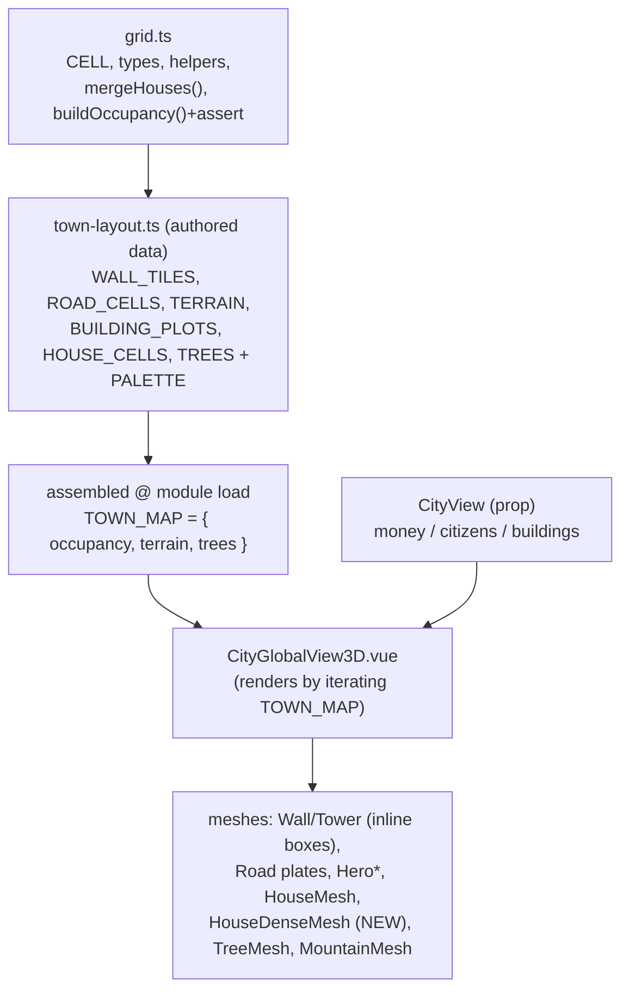

# Plan — 3D City as a Grid-Based Map

> Companion to [`requirements.md`](./requirements.md) (R1–R9) and
> [`request.md`](./request.md). Sub-feature `3d-city-grid` of CQR-53 — refactors the
> parent [R4](../requirements.md) 3D arm. Read-only (parent R6) throughout.

## Overview

A new framework-agnostic **grid module** (`views/city/grid.ts`) defines a fixed-cell
coordinate system (`CELL = 3`), occupant/terrain types, cell↔world helpers, the
deterministic **house dense-merge**, and the **single-occupant assertion**.
[`town-layout.ts`](../../../../src/components/environment/views/city/town-layout.ts) is
refactored from continuous scatter into **authored cell data** — wall tiles, road
tiles, terrain regions, 2×2 building plots, house cells and tree decorations — and
assembles them (with the merge + assertion) once at module load.
[`CityGlobalView3D.vue`](../../../../src/components/environment/views/CityGlobalView3D.vue)
is refactored to render purely by iterating that assembled data; one new mesh,
`HouseDenseMesh.vue`, renders merged 2×2 housing. Everything else (hero meshes, camera,
lighting, overlay, `CityView` prop, lazy-loading) is preserved.

The grid is **layout-only**: hardcoded data, no engine reads, no placement UI, no
per-tick rebuild (parent R4/R6). The point is to express the town as data and let the
"one building per cell" rule be machine-checked.

## Steering Document Alignment

No steering docs exist (`.spec-workflow/steering/` absent). The design follows the
conventions of the parent cycle and the existing `views/city/` code:

### Technical Standards
- TypeScript strict; no new `any`. Discriminated unions for occupants/terrain.
- Vue 3 `<script setup>` + TresJS, matching the current meshes; **no store**.
- Framework-agnostic logic (grid math, merge, assertion) in plain `.ts`; all `three`
  usage stays in `.vue` meshes.
- In-memory, computed once at module load (the existing `mulberry32` seed pattern may be
  reused for deterministic house/tree variety).

### Project Structure
```
src/components/environment/views/
├── CityGlobalView3D.vue          # MODIFIED — renders from assembled grid data
└── city/
    ├── grid.ts                   # NEW — cell model, types, helpers, merge, assertion (no Vue/three)
    ├── town-layout.ts            # MODIFIED — authored cell data + assembly; keeps PALETTE
    ├── HouseDenseMesh.vue        # NEW — 2×2 "5+" dense-housing mesh
    ├── HouseMesh.vue             # unchanged
    ├── TreeMesh.vue              # unchanged
    ├── MountainMesh.vue          # unchanged
    ├── MarketMesh.vue            # unchanged
    ├── BlacksmithMesh.vue        # unchanged
    ├── LumberMillMesh.vue        # unchanged
    └── MineMesh.vue              # unchanged
```

## Code Reuse Analysis

### Existing components to leverage
- **`PALETTE`** (`town-layout.ts`): all colours (grass/stone/water/field/path/wood/…)
  stay; the grid keeps using it so the look is unchanged.
- **`HouseMesh.vue`**: single-house render, prop-driven dims — reused for `house` cells
  and composed inside `HouseDenseMesh`.
- **`TreeMesh.vue` / `MountainMesh.vue`**: reused unchanged for tree decoration and the
  NW mountain backdrop.
- **Hero meshes** (`MarketMesh`/`BlacksmithMesh`/`LumberMillMesh`/`MineMesh`): reused at
  the 2×2 block centre; only their **position/scale** wrapper changes (a small per-model
  centring offset, captured in the plot config).
- **`mulberry32` / `pick`** (`town-layout.ts`): the deterministic PRNG can be reused to
  vary house dims/rotation and tree scale per cell without flicker.
- **`CityGlobalView3D.vue` scaffolding**: camera, ambient/directional light + shadow
  setup, fog, ground plane, the money/citizens overlay and the hero legend all stay.

### Integration points
- **Container** (`EnvironmentView.vue`): unchanged — still lazy-loads
  `CityGlobalView3D` for the no-active-tab state, bound to `useCityView()`.
- **`CityView`** (`types.ts`): unchanged contract; the component still reads only
  `view.money`, `view.citizens`, `view.buildings[]`.

## Architecture



### Modular design principles
- **`grid.ts`** owns the *model*: math, types, merge, validation. Pure, unit-testable,
  zero framework imports.
- **`town-layout.ts`** owns the *content*: the authored arrays + one assembly call that
  runs the merge and the assertion, exporting a ready `TOWN_MAP`.
- **`CityGlobalView3D.vue`** owns *presentation only*: iterate `TOWN_MAP` and dispatch
  each occupant/terrain/tree to a mesh. No layout maths in the template.

## Components and Interfaces

### `src/components/environment/views/city/grid.ts` — NEW
- **Purpose:** the grid model — the only place cell math, merge and validation live.
- **Interfaces:**
  ```typescript
  export const CELL = 3;                 // world units per cell
  export const GRID_MIN = -16;           // inclusive index bounds (covers ±48)
  export const GRID_MAX = 16;

  export type Cell = readonly [number, number];          // (i, j) integer indices
  export type Terrain = 'grass' | 'water' | 'field' | 'mountain' | 'road';

  export type Occupant =
    | { kind: 'wall'; variant: 'wall' | 'tower'; axis?: 'x' | 'z' }
    | { kind: 'building'; id: BuildingID }   // 2x2, anchored at this cell
    | { kind: 'house' }                      // 1x1
    | { kind: 'house-dense' };               // 2x2, anchored at this cell

  export interface PlacedOccupant { anchor: Cell; w: number; d: number; occ: Occupant; }

  export function cellCenter(i: number, j: number): [number, number];          // [i*CELL, j*CELL]
  export function blockCenter(i: number, j: number, w: number, d: number): [number, number];
  export const key = (i: number, j: number): string => `${i},${j}`;
  export function isBuildable(t: Terrain): boolean;                            // t === 'grass'

  /** Deterministic 2x2 greedy tiling. Pure: same input -> same output. */
  export function mergeHouses(houseCells: Cell[]): { dense: Cell[]; singles: Cell[] };

  /** Builds cell->occupant map; throws on overlap or non-buildable placement. */
  export function buildOccupancy(
    placed: PlacedOccupant[],
    terrainAt: (i: number, j: number) => Terrain,
  ): Map<string, PlacedOccupant>;
  ```
- **Key logic:**
  - `mergeHouses`: put house cells in a `Set`; iterate cells in ascending `(j, i)`; for an
    unconsumed `(i,j)`, if `(i+1,j)`,`(i,j+1)`,`(i+1,j+1)` are all present and unconsumed,
    emit a `dense` anchor at `(i,j)` and mark all four consumed; otherwise emit a `single`.
    Deterministic by the fixed scan order (R6.3–R6.4).
  - `buildOccupancy`: for each placed occupant, expand its `w×d` cells; for each cell
    assert (a) not already in the map and (b) `isBuildable(terrainAt(cell))` when the
    occupant is `building`/`house`/`house-dense` (walls/towers are exempt — they sit on
    the perimeter). Throw a descriptive `Error(`cell i,j claimed by … and …`)` on
    violation (R2.2–R2.3).
- **Dependencies:** `BuildingID` (type only). **No Vue, no `three`.**

---

### `src/components/environment/views/city/town-layout.ts` — MODIFIED
- **Purpose:** the authored map content + one-time assembly. Keeps `PALETTE`,
  `GROUND_SIZE`, the compass comment block, `MOUNTAINS`, and the `mulberry32`/`pick`
  helpers.
- **New authored data (all module-level constants):**
  ```typescript
  // Perimeter at ±5 cells. Gates left out; corners + bastions are towers.
  export const WALL_TILES: PlacedOccupant[]      // wall + tower tiles, axis tagged
  export const ROAD_CELLS: Cell[]                // (0,0..5) ∪ (−4..4,0)
  export const BUILDING_PLOTS: Partial<Record<BuildingID, {
    anchor: Cell; offset: [number, number]; scale: number; tone: string;
  }>>                                            // 2x2 plots from the snapping table
  export const HOUSE_CELLS: Cell[]               // interior grass cells (pre-merge)
  export const TREE_DECOS: { cell: Cell; offset: [number, number]; scale: number }[]
  export function terrainAt(i: number, j: number): Terrain  // water/field/mountain/road/grass
  ```
- **Assembly (runs once at load):**
  ```typescript
  const { dense, singles } = mergeHouses(HOUSE_CELLS);
  const placed: PlacedOccupant[] = [
    ...WALL_TILES,
    ...buildingPlotsToPlaced(BUILDING_PLOTS),     // w=d=2
    ...dense.map(anchorToDense),                  // w=d=2 'house-dense'
    ...singles.map(cellToHouse),                  // w=d=1 'house'
  ];
  export const OCCUPANCY = buildOccupancy(placed, terrainAt);   // throws on conflict
  export const TOWN_MAP = {
    occupants: placed,            // for render iteration
    roads: ROAD_CELLS.filter(c => !occupantCovers(OCCUPANCY, c)),  // C9: building wins
    terrainPatches: GROUND_PATCHES,   // sea + fields kept as today's plates
    mountains: MOUNTAINS,
    trees: TREE_DECOS.filter(t => isTreeCellFree(t.cell)),         // R7.2–R7.3
  };
  ```
- **Authored values (carried-over placement):**

  | Building   | anchor `(i,j)` | block centre    | mesh offset note                                                                 |
  |------------|----------------|-----------------|----------------------------------------------------------------------------------|
  | Market     | `(2, 2)`       | `[7.5, 7.5]`    | mesh ~centred; offset `[0,0]`                                                    |
  | Blacksmith | `(-2, -1)`     | `[-4.5,-1.5]`   | mesh ~centred; **covers road row j=0 at i=−2,−1 → road omitted there (C9/R4.3)** |
  | LumberMill | `(-11, -1)`    | `[-31.5,-1.5]`  | mesh authored off-origin → centring offset ≈ `[-0.8, 0.3]`, verify visually      |
  | IronMine   | `(-10, -9)`    | `[-28.5,-25.5]` | mesh ~centred; small offset if needed                                            |

- **Dependencies:** `grid.ts`, `BuildingID`. **No Vue, no `three`.**

---

### `src/components/environment/views/city/HouseDenseMesh.vue` — NEW
- **Purpose:** render a 2×2 `house-dense` block as a denser cluster reading as "5 or
  more" dwellings (e.g. 3–4 packed `HouseMesh` instances of varied size/height + a couple
  of half-cells, or one larger tenement block plus smaller annexes), filling the 6×6
  footprint.
- **Props:** `position: [number, number, number]` (the block centre), optional
  `rotationY`, `seed?: number` (for deterministic internal variety).
- **Presentation:** composes `HouseMesh` instances at fixed local offsets within the
  6×6 footprint; uses `PALETTE.walls`/`PALETTE.roofs`. Must visibly differ from a single
  `HouseMesh` and from the hero buildings (R6.5).
- **Dependencies:** Vue + `HouseMesh` + `PALETTE`. (Indirect `three` via `HouseMesh`.)

---

### `src/components/environment/views/CityGlobalView3D.vue` — MODIFIED
- **Purpose:** render the scene by iterating `TOWN_MAP`; keep all existing scaffolding.
- **Changes:**
  - Replace the `WALL_BOXES` loop with a loop over `TOWN_MAP.occupants` where
    `occ.kind === 'wall'`: render a box at `blockCenter(...)` sized `[CELL,H,T]` (axis `x`)
    or `[T,H,CELL]` (axis `z`) for `variant:'wall'`, or a `[towerW,towerH,towerW]` box for
    `variant:'tower'`.
  - Replace the `GROUND_PATCHES` path entries with a loop over `TOWN_MAP.roads` rendering
    a flat `CELL×CELL` plate per road cell (sea + fields stay as `terrainPatches`).
  - Hero buildings: iterate `occ.kind === 'building'`, look up the mesh by `occ.id`
    (existing `HERO_MODELS` map) and the plot's `offset`/`scale`, render at
    `blockCenter + offset`. Legend/`heroBuildings` still derived from `props.view.buildings`.
  - Houses: iterate `occ.kind === 'house'` → `HouseMesh` at `cellCenter`;
    `occ.kind === 'house-dense'` → `HouseDenseMesh` at `blockCenter`.
  - Trees: loop `TOWN_MAP.trees` → `TreeMesh` at `cellCenter(cell) + offset`.
  - Mountains, camera, lights, fog, ground, overlay, legend: **unchanged**.
- **Reactivity:** unchanged — only the overlay (`view.money`/`view.citizens`) and the
  legend update on a tick; `TOWN_MAP` is module-level constant data (parent R6, R9.2).

### Changes to existing files

| File                                                                                      | Change                                                                                                                                                                                           |
|-------------------------------------------------------------------------------------------|--------------------------------------------------------------------------------------------------------------------------------------------------------------------------------------------------|
| [town-layout.ts](../../../../src/components/environment/views/city/town-layout.ts)        | Refactor from continuous scatter to authored cell data + assembly (merge + assertion). Keep `PALETTE`, `GROUND_SIZE`, `MOUNTAINS`, `GROUND_PATCHES` (sea/fields), compass comment, PRNG helpers. |
| [CityGlobalView3D.vue](../../../../src/components/environment/views/CityGlobalView3D.vue) | Render from `TOWN_MAP` (wall/tower/road/building/house/house-dense/tree dispatch); keep camera/lights/overlay/legend.                                                                            |
| `city/grid.ts`                                                                            | **New** model module.                                                                                                                                                                            |
| `city/HouseDenseMesh.vue`                                                                 | **New** dense-housing mesh.                                                                                                                                                                      |

## Data Models

- **`Cell = readonly [number, number]`** — integer grid indices.
- **`Terrain`** — `grass | water | field | mountain | road`; `isBuildable === grass`.
- **`Occupant`** — discriminated union (`wall`/`building`/`house`/`house-dense`); trees
  are **not** occupants.
- **`PlacedOccupant`** — `{ anchor: Cell; w; d; occ }`; the unit the assertion validates
  and the renderer iterates.
- **`TOWN_MAP`** — `{ occupants, roads, terrainPatches, mountains, trees }`, frozen at
  module load.

All are plain data; none hold engine references or methods (parent R6).

## Error Handling

### Error scenarios
1. **Two occupants on one cell** — `buildOccupancy` throws at module load naming the
   cell + both occupants. Surfaces immediately in dev (R2.2–R2.3).
2. **Building/house on non-buildable terrain** (water/field/mountain/road) — same
   assertion throws (R2.3, R8.3).
3. **Building plot overlaps a road cell** (Blacksmith on the E–W road) — *not* an error:
   the road cell is filtered out where a building covers it (C9/R4.3); the building wins.
4. **Tree on an occupied or road/water cell** — filtered out during `TOWN_MAP` assembly
   (R7.2); never rendered, never asserted.
5. **House region not divisible into clean 2×2s** (L-shapes, odd widths) — `mergeHouses`
   emits as many 2×2 dense blocks as the deterministic scan finds and leaves the rest as
   singles (R6.3); never throws.
6. **Hero mesh mis-centred in its 6×6 plot** — a visual issue tuned via the plot
   `offset`/`scale`; flagged for the LumberMill (off-origin mesh). Not a runtime error.

## Testing Strategy

No automated runner is configured; verification is the parent cycle's pattern — manual
dev-server checks plus optional pure-function checks via `npm run console` (tsx).

### Pure unit checks (optional, no runner setup)
- `mergeHouses`:
  - a clean 2×2 → `{ dense: [(i,j)], singles: [] }`.
  - a 3×2 block → one dense 2×2 + two singles (deterministic).
  - an isolated single → `{ dense: [], singles: [(i,j)] }`.
- `buildOccupancy`: authoring two occupants on one cell throws; the real `TOWN_MAP`
  assembles without throwing.
- `cellCenter(5,5)` → `[15,15]`; `blockCenter(2,2,2,2)` → `[7.5,7.5]`.

### Manual verification checklist (dev server, no tab selected)
1. **Grid alignment:** walls form a continuous ring of tiles at the map edge `±15`; N/E/W
   gates are open gaps; the south (sea) side is open; corners + bastions show towers.
2. **Roads:** the gate path and E–W road read as tiled plates; no road tile pokes through
   the Blacksmith (building wins).
3. **Hero buildings:** Market, Blacksmith (inside) and LumberMill, IronMine (outside,
   north) sit within ~1 cell of their old spots; each model is centred in its 6×6 plot
   (check LumberMill offset).
4. **Houses:** the interior cluster shows a mix of single houses and at least one dense
   "5+" block where four houses meet; the dense block is visually distinct.
5. **Trees:** forest/greenery survives; no tree overlaps a building/house/road; Mine and
   Mill keep their clearance.
6. **Assertion:** temporarily duplicating a house cell onto an occupied cell makes the
   module throw at load (then revert).
7. **Read-only / reactivity:** money/citizens overlay updates each tick; the town does
   not rebuild; selecting/deselecting buildings swaps views cleanly.
8. **Isolation & types:** `vue-tsc -b` passes; the 3D component + meshes are still the
   only importers of `three`/`@tresjs/core` (the 2D path builds without them).
