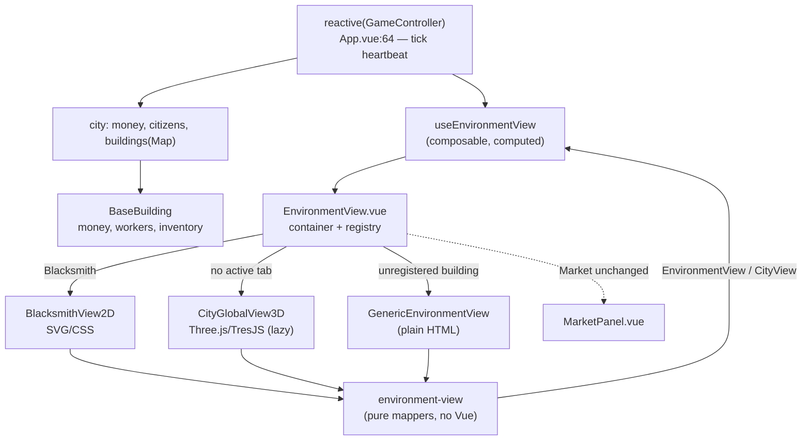

# Plan — Read-only Environment Interfaces

> Companion to [`requirements.md`](./requirements.md) and
> [`refined-brief.md`](./refined-brief.md). Authored into the cycle (CQR-53).

## Overview

A single render-agnostic **view-model** maps live game state into plain DTOs
(`EnvironmentView`, `CityView`). A Vue **composable** wraps that mapper in a `computed`
keyed to a per-tick heartbeat so views refresh every tick. A **container + registry**
replaces the `<pre>` dump at [App.vue:30](../../../src/App.vue#L30) and dispatches the
active building to its registered art view (or a thin generic fallback), and the
"no active tab" state to the city-global scene. Two art arms consume the *same*
view-model: a **2D** Blacksmith (SVG/CSS) and a **3D** city background (Three.js/TresJS,
lazy-loaded and cut-able). A written comparison picks the art direction for rollout.

The split is deliberate: **data is shared; only the art differs.** That is what makes
this a fair 2D-vs-3D bake-off rather than two unrelated screens.

## Steering Document Alignment

No steering docs exist (`.spec-workflow/steering/` absent). The design instead follows
the conventions visible in the codebase and the City Market spec:

### Technical Standards
- TypeScript strict; no new `any` (the one exception is reading `building._data: any`).
- Vue 3 Composition API + `reactive()` / `computed()`; **no store library**, matching
  `App.vue` and `MarketPanel.vue`.
- Framework-agnostic domain/presentation logic in `src/modules/`; Vue UI in
  `src/components/` — mirrors `src/modules/market/` vs `src/components/buildings/`.
- In-memory only; no persistence.

### Project Structure
```
src/
├── modules/environment-view/        # render-agnostic, no Vue, no three
│   ├── types.ts                     # EnvironmentView, WorkerView, InventoryRow, CityView
│   └── environment-view.ts          # pure mappers + label/progress helpers
└── components/environment/          # Vue layer
    ├── useEnvironmentView.ts        # composable: tick-heartbeat reactivity
    ├── environment-registry.ts      # BuildingID -> art component
    ├── EnvironmentView.vue          # container (replaces the <pre> dump)
    ├── GenericEnvironmentView.vue   # thin read-only fallback (plain HTML)
    └── views/
        ├── BlacksmithView2D.vue     # 2D art arm (SVG/CSS)
        └── CityGlobalView3D.vue     # 3D art arm (Three.js/TresJS), lazy-loaded
```

## Code Reuse Analysis

### Existing Components to Leverage
- **`reactive(GameControllerSingleton)`** ([App.vue:64](../../../src/App.vue#L64)):
  the single reactive source. `controller.tick` ([App.vue:35](../../../src/App.vue#L35))
  is the proven per-tick heartbeat; `controller.city` exposes `money`,
  `citizens_count`, and the `buildings` Map.
- **`BaseBuilding`** ([Building.ts](../../../src/game/city/buildings/common/Building.ts)):
  read `money`, `workers`, `inventory`, `static.name`. `_data.inventory` is refreshed
  each `handleTick` ([Building.ts:47](../../../src/game/city/buildings/common/Building.ts#L47)).
- **`Worker` / `Action`** ([Worker.ts](../../../src/game/city/buildings/common/Worker.ts),
  [Action.ts](../../../src/game/city/buildings/common/Action.ts)): read
  `worker.active_action`, then `action.constructor.name`, `ticks_remaining`,
  `total_ticks`, `isDone()`.
- **`InventoryAccountService.getCountByGoodId()`**: returns `Map<ItemID, number>`.
- **`ItemRegistry`** ([registry.ts](../../../src/modules/items/registry.ts)):
  `ItemRegistry[id].name` / `.value` (`IItem` exposes both;
  [MarketPanel.vue:52](../../../src/components/buildings/MarketPanel.vue#L52) already uses
  `.name`).
- **`MarketPanel.vue`**: precedent for a read-only, reactive building panel; stays the
  Market's renderer untouched.
- **`GameController.isNight()`** (public; used at
  [IronMine.ts:50](../../../src/game/city/buildings/IronMine.ts#L50)): available to the
  3D scene for ambient day/night — read-only, optional.

### Integration Points
- **`App.vue`**: replace `<pre v-else>{{ activeBuilding }}</pre>` with
  `<EnvironmentView :building-id="active_building_id" />`. The `Market` branch is
  unchanged.
- **`BuildingsList`**: no change — selection already drives `active_building_id`.

## Architecture



### Modular Design Principles
- **`environment-view` module** owns mapping only — pure functions, unit-testable,
  zero framework imports.
- **`useEnvironmentView`** owns reactivity only — the tick heartbeat and fresh building
  resolution.
- **`EnvironmentView.vue`** owns dispatch only — registry lookup + the three fallbacks
  (art view / generic / city-global).
- **Art views** own presentation only — they receive a ready `EnvironmentView` /
  `CityView` and never read engine state directly.

## Components and Interfaces

### `src/modules/environment-view/types.ts`
- **Purpose:** the shared, render-agnostic contract.
- **Interfaces:**
  ```typescript
  export type WorkerStatus = 'idle' | 'working';

  export interface WorkerView {
    label: string;          // index-based, e.g. "Smith 1"
    task: string | null;    // raw action identifier, null when idle
    progress: number;       // 0..1, clamped
    status: WorkerStatus;
  }

  export interface InventoryRow {
    itemId: ItemID;
    name: string;           // ItemRegistry[itemId].name
    count: number;
    unitValue: number;      // ItemRegistry[itemId].value
  }

  export interface EnvironmentView {
    id: BuildingID;
    name: string;           // building.static.name
    funds: number;          // building.money
    workers: WorkerView[];
    inventory: InventoryRow[];
  }

  export interface CityBuildingSummary {
    id: BuildingID;
    name: string;
    funds: number;
    workerCount: number;
  }

  export interface CityView {
    money: number;          // city.money
    citizens: number;       // city.citizens_count
    buildings: CityBuildingSummary[];
  }
  ```
- **Dependencies:** `ItemID`, `BuildingID` (types only).

---

### `src/modules/environment-view/environment-view.ts`
- **Purpose:** pure mappers + the verified label/progress helpers.
- **Interfaces:**
  ```typescript
  export function resolveTaskLabel(action: Action | null): string | null
  export function workerProgress(action: Action | null): number
  export function mapWorker(worker: Worker, index: number, label: string): WorkerView
  export function mapEnvironmentView(building: BaseBuilding): EnvironmentView
  export function mapCityView(city: City): CityView
  ```
- **Key logic (verified against the code):**
  - `resolveTaskLabel`: `action ? action.constructor.name : null`. **This is the
    correction the refined brief makes** — every Blacksmith production action sets
    `static name` and **no** instance `name`, so `active_action.name` is `undefined`;
    `constructor.name` (≡ `static.name`) is the reliable specific label. Returned raw
    (no humanization), per decision.
  - `workerProgress`: if `action` is null or `action.isDone()` → `0`; else
    `const p = 1 - action.ticks_remaining / action.total_ticks;`
    return `Number.isFinite(p) ? Math.min(1, Math.max(0, p)) : 0`. This absorbs
    `total_ticks ≤ 0` and the `ticks_remaining = 999` pre-start sentinel.
  - `mapWorker.status`: `(worker.active_action && !worker.active_action.isDone())
    ? 'working' : 'idle'`. (Night-stall detection is **out of scope** — `shouldTick()`
    is protected and per-action; the Blacksmith has no night guard anyway. Noted as a
    later enhancement.)
  - `mapEnvironmentView.inventory`: iterate `building.inventory.getCountByGoodId()`,
    map each `[itemId, count]` to an `InventoryRow` via `ItemRegistry[itemId]`.
  - Worker labels: a short per-building prefix + 1-based index (e.g. "Smith 1"). A small
    `BuildingID → workerLabelPrefix` map keeps this declarative.
- **Dependencies:** `ItemRegistry`, `Action`/`Worker`/`BaseBuilding`/`City` (read-only),
  the `types.ts` contract. **No Vue.**

---

### `src/components/environment/useEnvironmentView.ts`
- **Purpose:** the only place reactivity lives.
- **Interfaces:**
  ```typescript
  export function useEnvironmentView(
    buildingId: Ref<BuildingID | null>,
  ): ComputedRef<EnvironmentView | null>

  export function useCityView(): ComputedRef<CityView>
  ```
- **Reactivity mechanism (the #1 feasibility item):**
  ```typescript
  const controller = reactive(GameControllerSingleton) as GameController;
  return computed(() => {
    void controller.tick;                       // per-tick heartbeat
    const id = buildingId.value;
    if (!id) return null;
    const b = controller.city.buildings.get(id);
    return b ? mapEnvironmentView(b) : null;    // resolve fresh each tick
  });
  ```
  Touching `controller.tick` forces re-evaluation every tick regardless of whether deep
  nested mutations propagate through the reactive proxy during the auto-run loop. The
  building is resolved fresh from the reactive `buildings` map so reads go through the
  proxy. **Task 2 must verify live updates before the art arms are built.**
- **Dependencies:** `GameControllerSingleton`, `mapEnvironmentView` / `mapCityView`.
- **Reuses:** the exact `reactive(GameControllerSingleton)` pattern from `App.vue`.

---

### `src/components/environment/environment-registry.ts`
- **Purpose:** single source of truth for `BuildingID → art component`.
- **Interface:**
  ```typescript
  // Lazy so `three` is only fetched when the 3D arm actually renders.
  export const environmentArtRegistry: Partial<Record<BuildingID, Component>> = {
    [BuildingID.BlackSmith]: defineAsyncComponent(() => import('./views/BlacksmithView2D.vue')),
  };
  ```
- **Note:** IronMine / LumberMill intentionally have **no** entry in this slice — they
  resolve to the generic fallback. They become registry entries in the rollout cycles.

---

### `src/components/environment/EnvironmentView.vue`
- **Purpose:** container that replaces the `<pre>` dump and dispatches.
- **Props:** `buildingId: BuildingID | null`.
- **Logic:**
  - `buildingId === null` → render `CityGlobalView3D` (lazy) bound to `useCityView()`.
  - registered art view exists → render it, bound to `useEnvironmentView(buildingId)`.
  - otherwise → render `GenericEnvironmentView`, bound to the same view-model.
- **Dependencies:** registry, the two composables, the fallback + 3D components.
- **Note:** the Market is filtered out *upstream* in `App.vue` (its `v-if` branch is
  unchanged); this container is only mounted for the non-Market `v-else` path.

---

### `src/components/environment/GenericEnvironmentView.vue`
- **Purpose:** thin, read-only, plain-HTML rendering of an `EnvironmentView` — the
  fallback so no environment shows a raw dump. Doubles as proof the view-model is
  render-agnostic (a *third* consumer alongside 2D and 3D).
- **Props:** `view: EnvironmentView | null`. Renders name, funds, a worker list
  (label · task · progress bar), and an inventory table — Tailwind only, no SVG/3D.

---

### `src/components/environment/views/BlacksmithView2D.vue` — 2D art arm
- **Purpose:** SVG/CSS depiction of the blacksmith interior.
- **Props:** `view: EnvironmentView | null` (from `useEnvironmentView`).
- **Presentation:** an SVG scene with **2** worker figures (Smith 1 / Smith 2), each
  showing its raw task label and a progress bar/ring driven by `worker.progress`; an
  inventory area (e.g. labelled item chips/shelf with counts); and a funds readout.
  Read-only; updates live via the reactive prop.
- **Dependencies:** none beyond Vue + the view-model DTO. **No `three`.**

---

### `src/components/environment/views/CityGlobalView3D.vue` — 3D art arm (cut-able)
- **Purpose:** ambient 3D backdrop of the city for the no-active-tab state.
- **Props:** `view: CityView`.
- **Presentation:** a `<TresCanvas>` scene placing one simple mesh per
  `view.buildings[]` entry (the city "in the background"), with a money + citizens
  overlay (plain HTML over the canvas). Optionally tint lighting by
  `controller.isNight()`. Thin by design.
- **Dependencies:** `three`, `@tresjs/core` (NEW). Imported only here; component is
  lazy-loaded so these stay out of the 2D/initial bundle.
- **Cut rule:** if the 2D arm already feels right, stop before completing this and
  record why in the comparison (R5/Task 6).

---

### Changes to existing files

| File | Change |
|------|--------|
| [src/App.vue](../../../src/App.vue) | Replace `<pre v-else>{{ activeBuilding }}</pre>` (line 30) with `<EnvironmentView v-else :building-id="active_building_id" />`; import the container. Market `v-if` branch unchanged. |
| [package.json](../../../package.json) | Add `three` + `@tresjs/core` to `dependencies` (3D arm only). |

## Data Models

`EnvironmentView`, `WorkerView`, `InventoryRow`, `CityView`, `CityBuildingSummary` —
defined in full under *Components → types.ts* above. All are plain, serializable-shaped
DTOs with no methods and no engine references.

## Error Handling

### Error Scenarios
1. **Worker has no/just-finished action** — `mapWorker` returns
   `status:'idle', task:null, progress:0`. User sees an idle worker, never a crash or
   `undefined` label.
2. **Pre-start / zero-tick action** (`ticks_remaining = 999`, or `total_ticks ≤ 0`) —
   `workerProgress` clamps to `0`. No negative/`NaN`/`>1` bars.
3. **Building not found for an id** — `useEnvironmentView` returns `null`; the container
   renders nothing for that frame rather than throwing.
4. **Building has no registered art view** — container renders `GenericEnvironmentView`;
   never a blank panel or raw dump.
5. **3D deps not installed / 3D arm cut** — the 3D component is lazy and isolated; the
   2D path and generic fallback compile and run without `three`. The no-active-tab state
   degrades to a minimal placeholder if the arm is cut.

## Testing Strategy

No automated test runner is configured; verification is manual via the dev server,
plus optional pure-function unit checks.

### Pure unit checks (optional, no runner setup required)
- `resolveTaskLabel` / `workerProgress` are pure — can be exercised via
  `npm run console` (tsx) with constructed actions to confirm: `MakeIngotAction` →
  `"MakeIngot"`; idle → `null` / `0`; `ticks_remaining=999` → `0`.

### Manual verification checklist
1. **Reactivity (gate):** start the game (Resume) and Next-Tick; the Blacksmith view's
   worker progress and inventory update each tick with no manual refresh. *(Confirms the
   tick-heartbeat mechanism — do this before building the art arms.)*
2. **Container:** the `<pre>` dump is gone; IronMine / LumberMill show the generic view;
   the Market still shows `MarketPanel` with its controls.
3. **2D Blacksmith:** two workers labelled Smith 1 / Smith 2, each with a raw task label
   and a moving progress bar; inventory counts and funds visible and live; 5-second
   legibility check passes.
4. **3D city-global:** with no tab selected, the city renders as a 3D backdrop with
   money + citizens overlaid; frame rate stays smooth; selecting/deselecting a building
   swaps views cleanly.
5. **Bundle isolation:** temporarily uninstalling `three`/`@tresjs/core` still lets the
   2D path build (`vue-tsc -b`) — proves the 3D dep is isolated/lazy.
6. **Read-only:** no view calls a mutator; running with views open never changes game
   state beyond the normal tick loop.
7. `vue-tsc -b` (the `build` script) passes with zero type errors.
8. Comparison write-up exists under `.specs/` with a recommendation + enumerated rollout
   follow-ups.
